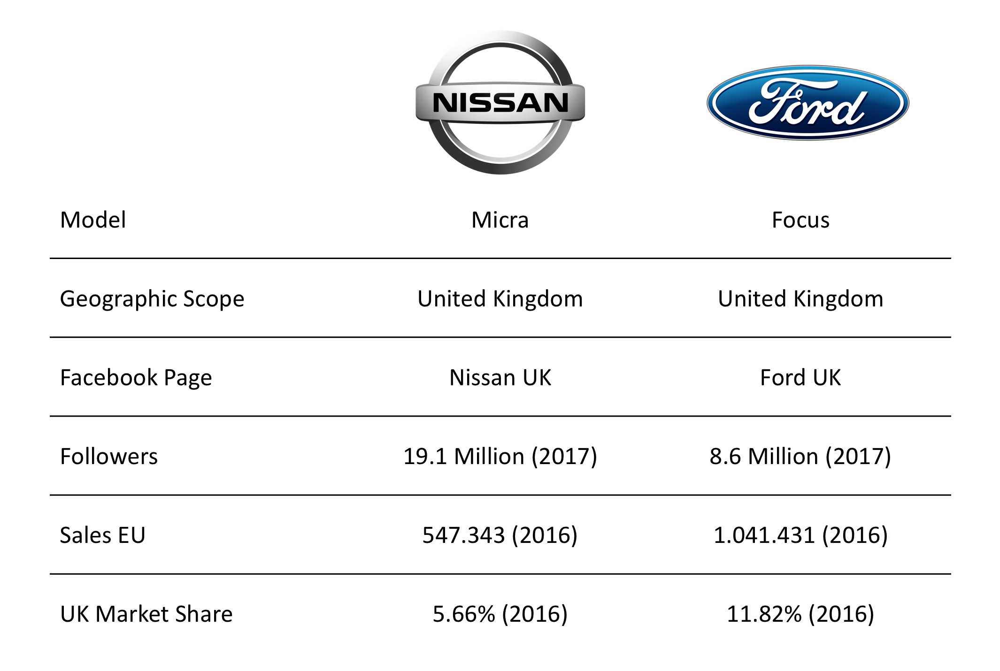

```{r setup, include = FALSE}
knitr::opts_chunk$set(comment = "#", message = FALSE, warning = FALSE) 
```

```{r set-options, echo = FALSE, cache = FALSE}
options(width = 60)
```

```{r, echo = FALSE}
setwd("/Users/julianblau/Desktop/MATH500-Presentation")
```


# 1. Overview 

## Company Overview



## Approach to Research 

- The aim of our analysis was to compare the launch events of the new Ford Fiesta and new Nissan Micra       via Facebook
- Sentiment Analysis was carried out on the launch posts to compare customer reactions to the new            products
- T-tests were conducted on the manufacturer's UK Facebook pages to determine whether the launches had an       impact on customer engagment  


# 2. Sentiment Analysis

## Sentiment Analysis Overview


```{r, include=FALSE}
setwd("/Users/julianblau/Desktop/MATH500-Presentation")
library(Rfacebook)
citation("Rfacebook")
library(stringr) # Character manipulation
library(dplyr) # Data wrangling
library(ggplot2) # Graphics
library(tidyr) # Turning wide data into long data
library(tm) # Text mining
library(wordcloud) # Word cloud
library(network) # Network diagram
library(curl) # Needed to get information about me and my friends
library(httr) # Needed to get information about me and my friends
library(lubridate) # For date manipulation
library(scales) # To format axes
format.facebook.date <- function(datestring) {
  date <- as.POSIXct(datestring,
                     format = "%Y-%m-%dT%H:%M:%S+0000",
                     tz = "GMT")
  date
}
remove_http_www <- function(some_txt){
  some_txt <- str_replace_all(some_txt,
                              "http\\:\\/\\/[A-Za-z0-9\\.\\/\\?\\=]+(\\s?)", "")
  some_txt <- str_replace_all(some_txt,
                              "https\\:\\/\\/[A-Za-z0-9\\.\\/\\?\\=]+(\\s?)", "")
  some_txt <- str_replace_all(some_txt,
                              "www\\.[A-Za-z0-9\\.\\/\\?\\=]+(\\s?)", "")
  return(some_txt)
}
remove.numbers <- function(some_txt){
  some_txt <- str_replace_all(some_txt, "\\s\\d+", " ") #
  some_txt <- str_replace_all(some_txt, "\\(\\d+\\)", "")
  some_txt <- str_replace_all(some_txt, "^\\d+\\s", "")
  some_txt <- str_replace_all(some_txt, "\\s\\d+$", "")
  some_txt
}
remove.spaces <- function(some_txt){
  some_txt <- str_replace_all(some_txt, "\\s{2,}", " ")
  some_txt <-  str_replace_all(some_txt, "^\\s+|\\s+$", "")
  some_txt
}
match_with_negation <- function(phrase, word_table, consider_negation = TRUE,
                                negation_dictionary = c("not", "isn't","aren't", "haven't","won't", "doesn't", "no", "as")){
  individual_words <- unlist(str_split(phrase, '\\s+')) # Needs package stringr
  individual_words <- individual_words[!individual_words %in% c("a", "the")]
  match_positions_in_table <- match(individual_words, word_table)
  match_positions_in_phrase <- which(!is.na(match_positions_in_table))
  number_of_matches <- sum(!is.na(match_positions_in_table))
  if(consider_negation){
    previous_words_position <- match_positions_in_phrase - 1
    previous_words_position <- previous_words_position[previous_words_position > 0]
    previous_words <- individual_words[previous_words_position]
    negation_words <- previous_words[previous_words %in% negation_dictionary]
    number_of_matches <- number_of_matches - length(negation_words)
  }
  number_of_matches
}

setwd("/Users/julianblau/Desktop/MATH500-Presentation")
# Read in Fiesta Comment Data
fiesta_comments <- read.csv(file="FiestaCommentData.csv", header=TRUE, sep=",")
fiesta_comments

# Read in Micra Comment Data
micra_comments <- read.csv(file="MicraCommentData.csv", header=TRUE, sep=",")
micra_comments


# Read in positive and negative word lists
pos <- scan("positive-words.txt", what = "character", comment.char = ";")
neg <- scan("negative-words.txt", what = "character", comment.char = ";")


# Calculate Fiesta Sentiments
fiesta_sentiments <- fiesta_comments %>%
  rowwise() %>% # Needed because match_with_negation is not a vectorized function
  mutate(pos = match_with_negation(message_cleaned, pos), # Positive matches
         neg = match_with_negation(message_cleaned, neg), # Negative matches
         score = pos - neg) %>%
  ungroup() # Remove rowise grouping

fiesta_sentiments %>% select(pos, neg, score) %>% head()


# Calculate Micra Sentiments
micra_sentiments <- micra_comments %>%
  rowwise() %>% # Needed because match_with_negation is not a vectorized function
  mutate(pos = match_with_negation(message_cleaned, pos), # Positive matches
         neg = match_with_negation(message_cleaned, neg), # Negative matches
         score = pos - neg) %>%
  ungroup() # Remove rowise grouping

micra_sentiments %>% select(pos, neg, score) %>% head()

# Sort Sentiments into ascending order
fiesta_sentiments <- fiesta_sentiments[order(fiesta_sentiments$score),]
micra_sentiments <- micra_sentiments[order(micra_sentiments$score),]

# Calculate the top and bottom 0.5% of Micra comments
micra_n <- nrow(micra_sentiments)
micra_lqt <- floor(0.005 * micra_n)
micra_uqt <- floor(0.995 * micra_n)

# Calculate the top and bottom 0.5% of Fiesta comments
fiesta_n <- nrow(fiesta_sentiments)
fiesta_lqt <- floor(0.005 * fiesta_n)
fiesta_uqt <- floor(0.995 * fiesta_n)

# Remove outliers from Micra and Fiesta analysis
micra_sentiments <- micra_sentiments [-c(1:micra_lqt, micra_uqt:micra_n), ] 
fiesta_sentiments <- fiesta_sentiments [-c(1:fiesta_lqt, fiesta_uqt:fiesta_n), ] 

fiesta_sentiments <- fiesta_sentiments %>%
  rowwise() %>% # Needed because match_with_negation is not a vectorized function
  mutate(car = "Fiesta")
#View(fiesta_sentiments)
micra_sentiments <- micra_sentiments %>%
  rowwise() %>% # Needed because match_with_negation is not a vectorized function
  mutate(car = "Micra")

joint_data <- rbind(fiesta_sentiments, micra_sentiments)

joint_data <- joint_data %>% group_by(car)


# #17407e - Ford Blue Hex Code
# #b40024 - Nissan Red Hex Code
colours <- c("#17407e", "#b40024")

# Add Mean and Standard Deviation to joint_data
sentiment_means <- joint_data %>%
  group_by(car) %>%
  summarize(mean = mean(score))
sentiment_means
standard_deviations <- joint_data %>%
  group_by(car) %>%
  summarise(sd = sd(score))
standard_deviations

```

```{r, echo=FALSE, fig.width = 5, fig.height = 2.5, fig.align="center"}
setwd("/Users/julianblau/Desktop/MATH500-Presentation")
#View(joint_data)
ggplot(joint_data, aes(x = score)) +
  geom_bar(aes(fill = factor(car))) +
  facet_wrap(~ car) +
  # Fill the graphs with Ford and Nissan colour schemes
  scale_fill_manual(name = "", values = colours) +
  # Place key at the bottom of the graph
  theme(legend.position="none", panel.grid.minor = element_blank()) +
  # Graph labels
  labs(x = "Sentiment Score" ,
       y = "Number of Posts") +
  scale_x_continuous(breaks=c(-4:4)) +
  # Mark trimmed mean lines for each graph
  geom_vline(data = sentiment_means, aes(xintercept = mean)) +
  # Mark trimmed mean text of each graph
  geom_text(aes(x = mean,
                y = Inf,
                label = "Mean"), # Show to three significant figures
            vjust = 1.5,
            hjust = -0.2,
            data = sentiment_means)
```

```{r, include=FALSE}
m1<-sentiment_means$mean[1]
m2<-sentiment_means$mean[2]
sd1<-standard_deviations$sd[1]
sd2<-standard_deviations$sd[2]
m1 ### does not display mean value


```


|Model|Standard Deveiation|Mean| No. Outliers|
|------|:------:|:------:|:------:|
| Ford Fiesta | `r sd1` | `r m1` |  3| 
| Nissan Micra | `r sd2` | `r m2` | 6| 
| |  | | |
| |  | | |

## Sentiment Analysis Result

###Outliers
- Outliers were identified within the data set when initially visualising the sentiment scores
- Trimming the top and bottom 0.5% of data yielded the best results in removing outliers while               maintaining the integrety of the data


###Findings
- The Nissan post contained ~3 times as many comments as Ford
- The comments towards the Nissan Micra were generally twice as positive as those towards the Ford Fiesta
- The majority of neutral comments were from people tagging their freinds 


# 3. T-test

## T-test Overview

```{r, include=FALSE}
# This is the code for the final presentation of the T-test
#
setwd("/Users/julianblau/Desktop/MATH500-Presentation")
#
library(readr)
# The data I am reading here is the fiesta_trimmed and the micra_trimmed but with the 
# dates after the manipulation with Julian Straker script and with the new colum of
# the positive reactions count
ford <- read_csv("fiesta_trimmed_dates.csv")
nissan <- read_csv("micra_trimmed_dates.csv")
#
###
#--1)Here is the code for the first slite of our part--------------------------------
#
# Here we select the data from we are going to visualize
library(dplyr)
ford_select <- ford %>% select(col_id,shares_count,like_button,positive_reaction)
nissan_select <- nissan %>% select(col_id,shares_count,like_button,positive_reaction)
#
# Now we have to provide the data in a long form in order to visualize in a plot
#
library(tidyr) # to use the gather function to made the data in a long form
# 
ford_nissan_wide <- full_join(ford_select,nissan_select,by = c("col_id"))
# Rename the colum to be undestandable
ford_nissan_wide <- ford_nissan_wide %>% 
  rename(Ford_Shares=shares_count.x,Ford_Likes = like_button.x,Ford_Positive = positive_reaction.x,
         Nissan_Shares =shares_count.y,Nissan_Likes = like_button.y,Nissan_Positive = positive_reaction.y)
##
# Now make the data long.
ford_nissan_long <- gather(ford_nissan_wide, key = "Reactions",
                           values = Ford_Shares:Nissan_Positive,na.rm = TRUE,Values)
#
##
### Now we are making the ggplot of all the data
# #17407e - Ford Blue Hex Code
# #b40024 - Nissan Red Hex Code
colours <- c("#17407e", "#b40024")
library(ggplot2)
ford_nissan_long_sep <- ford_nissan_long %>% separate("Reactions",
                                                      c("Manufacturer","Reaction"))
ford_nissan_long_sep
```

```{r, echo=FALSE, fig.height=6}
#View(joint_data)
ggplot(ford_nissan_long_sep, aes(x = Manufacturer, y = Values,col = Manufacturer)) +
  geom_boxplot() +
  facet_wrap(~ Reaction,scales = "free_y") +
  # Fill the graphs with Ford and Nissan colour schemes
  scale_colour_manual(name = "", values = colours) +
  # Place key at the bottom of the graph
  theme(axis.text=element_text(size=17), axis.title=element_text(size=22), legend.position="none", panel.grid.minor = element_blank())+
  # Graph labels
  geom_jitter(position = position_jitter(width = 0.4, height =0), alpha= 0.25) +
  scale_y_log10()

```

```{r, echo=FALSE, include=FALSE}
# run the t.test
ford_shares <- ford %>% select(shares_count) %>% mutate(company = "Ford")
nissan_shares <- nissan %>% select(shares_count) %>% mutate(company = "Nissan")
shares_long <- rbind(ford_shares,nissan_shares)
shares<-t.test(shares_count[shares_count < 1800] ~ company[shares_count < 1800],data = shares_long,var.test = FALSE , alternative = "greater")
#with the outline point I have a significance p-value = 0.02258. When i remove the
#outiers under the 1800 again a have significance p-value = 0.01039 the sicnificans almost halfed
##
#
ford_likes <- ford %>% select(like_button) %>% mutate(company = "Ford")
nissan_likes <- nissan %>% select(like_button) %>% mutate(company = "Nissan")
like_long <- rbind(ford_likes,nissan_likes)
likes<- t.test(like_button[like_button < 5500] ~ company[like_button < 5500] , data = like_long,var.test = FALSE , alternative = "greater")
# when I run the test with the outlier i have p-value = p-value = 0.0001341
# When I remove the outline point under 5500 just to remove the outliers of Nissan i
# have a p-value = 0.0004224
##
#
ford_positive <- ford %>% select(positive_reaction) %>% mutate(company = "Ford")
nissan_positive <- nissan %>% select(positive_reaction) %>% mutate(company = "Nissan")
positive_long <- rbind(ford_positive,nissan_positive)
positive <- t.test(positive_reaction[positive_reaction < 500] ~ company[positive_reaction < 500], data = positive_long,var.test = FALSE,alternative = "greater")
# If we keep the outline point we resive a result p-value = 0.000377 and if we cut the  under
# 500 or 450 we take as a p-value = 0.01313. That mean Ford mean have significance differned from
# Nissan
##
#
ford_comments <- ford %>% select(comments_count) %>% mutate(company = "Ford")
nissan_comments <- nissan %>% select(comments_count) %>% mutate(company = "Nissan")
comment_long <- rbind(ford_comments,nissan_comments)
t.test(comments_count ~ company , comment_long , var.test = TRUE)
# With the comment we never take a good result even if we assume that the alternative is
# less or grater or equal, even if we take var.test = TRUE the result we have is grater
# than 0.45 which means that we know that the that is significant different and we assume
# that the reaction of comment did not have any corelation at all as a very difficalt rection
# from the grater part of people.
library(tidyr)
graphLabels <- data.frame(Compound = c("Likes", "Positive","Shares"),
                          Pval = paste("p =", c(signif(likes$p.value, 4),
                                                signif(positive$p.value, 4),
                                               signif(shares$p.value, 4))))
p_p <- signif(positive$p.value,2)
p_like <- format(signif(likes$p.value,2), scientific = FALSE)
p_shares <- signif(shares$p.value,2)
paste("Hello", p_p, p_like, p_shares)
```

| |Likes|Positives| Shares|
|------|:------:|:------:|:------:|
| p-Value |  `r p_like` | `r p_p`  | `r p_shares` |


## T-test Overview (over time)

```{r, echo=FALSE}

library(readr)
ford <- read_csv("fiesta_trimmed_dates.csv")
nissan <- read_csv("micra_trimmed_dates.csv")
#
## We create a factor with the months in order to make the plot with the same stating point 
## once our sample has a difference stating points
#
library(dplyr)
library(tidyr)
n <- c("Month 1","Month 2","Month 3","Month 4","Month 5","Month 6","Month 7")
Observed_Month <- factor(n,levels = c("Month 1","Month 2","Month 3","Month 4","Month 5","Month 6","Month 7"))
#
## We select from the df Ford and Nissan the data we are need to present in the graphs then we grouped bu month
## summarize the basic statistics and at the end we mutate the above factor and the Manufacturer need it for the plots 
## We need the proportion of the engagement thats why we divided by the folowers fans multiply by 1000 for 
## better visualization of the table.
#
ford_statistics_proportion <- ford %>%
  select(month, shares_count,like_button,positive_reaction) %>%
  group_by(month) %>% summarise(Shares_mean = (mean(shares_count)/8414646)*1000,Shares_median = (median(shares_count)/8414646)*1000,
                                Shares_sd = (sd(shares_count)/8414646)*1000,Shares_IQR = (IQR(shares_count)/8414646)*1000,
                                Likes_mean = (mean(like_button)/8414646)*1000,Likes_median = (median(like_button)/8414646)*1000,
                                Likes_sd = (sd(like_button)/8414646)*1000,Likes_IQR = (IQR(like_button)/8414646)*1000, 
                                Positive_mean = (mean(positive_reaction)/8414646)*1000,Positive_median = (median(positive_reaction)/8414646)*1000,
                                Positive_sd = (sd(positive_reaction)/8414646)*1000,Positive_IQR = (IQR(positive_reaction)/8414646)*1000, number_Of_post = n())%>%
  mutate(Observed_Month = Observed_Month, Manufacturer = "Ford") 
#
## The same for Nissan Page
#
nissan_statistics_propotrion <- nissan %>% 
  select(month, shares_count,like_button,positive_reaction) %>%
  group_by(month) %>% summarise(Shares_mean = (mean(shares_count)/18414646)*1000,Shares_median = (median(shares_count)/18414646)*1000,
                                Shares_sd = (sd(shares_count)/18414646)*1000,Shares_IQR = (IQR(shares_count)/18414646)*1000,
                                Likes_mean = (mean(like_button)/18414646)*1000,Likes_median = (median(like_button)/18414646)*1000,
                                Likes_sd = (sd(like_button)/18414646)*1000,Likes_IQR = (IQR(like_button)/18414646)*100, 
                                Positive_mean = (mean(positive_reaction)/18414646)*1000,Positive_median = (median(positive_reaction)/18414646)*1000,
                                Positive_sd = (sd(positive_reaction)/18414646)*1000,Positive_IQR = (IQR(positive_reaction)/18414646)*1000, number_Of_post = n())%>%
  mutate(Observed_Month = Observed_Month, Manufacturer = "Nissan") 
## Put together the data one on the top of the other with the rbind from the Base package in order to have the 
## data straight forward in a long form
#
Combined_df_proportion <- rbind(ford_statistics_proportion, nissan_statistics_propotrion)
#
library(ggplot2)

# The colours for the scale
colours <- c("#17407e", "#b40024")
#
# We put in a variables p1,p2,p3,p4 the 4 graphs in order to make it one with the grid and gridExtra package
#
p4 <- ggplot(data = Combined_df_proportion, aes(x=Observed_Month, y=Shares_median, group=Manufacturer, colour=Manufacturer)) + 
  geom_line() + 
  geom_point() +
  scale_colour_manual(name = "", values = colours) +
  ggtitle("Shares per Follower")
  #theme(axis.text=element_text(size=15))
# 
p1 <- ggplot(data = Combined_df_proportion, aes(x=Observed_Month, y=Likes_median, group=Manufacturer, colour=Manufacturer)) +
  geom_line() +
  geom_point()+
  scale_colour_manual(name = "", values = colours) +
  ggtitle("Likes per Follower") +
  theme(legend.direction = "horizontal")
#  
p2 <- ggplot(data = Combined_df_proportion, aes(x=Observed_Month, y=Positive_median, group=Manufacturer, colour=Manufacturer)) +
  geom_line() + 
  geom_point()+
  scale_colour_manual(name = "", values = colours) +
  ggtitle("Positive Reactions per Follower")
  #theme(axis.text=element_text(size=15))
#  library(dplyr)
p3 <- ggplot(data = Combined_df_proportion, aes(x=Observed_Month, y=number_Of_post, group=Manufacturer, colour=Manufacturer)) +
  geom_line() + 
  geom_point() +
  scale_colour_manual(name = "", values = colours) +
  ggtitle("Number of Posts per Page")
  #theme(axis.text=element_text(size=15))
#
## This function help us to put the Legend on the button about the groups we have in ggplot
#
g_legend<-function(a.gplot){
    tmp <- ggplot_gtable(ggplot_build(a.gplot))
    leg <- which(sapply(tmp$grobs, function(x) x$name) == "guide-box")
    legend <- tmp$grobs[[leg]]
    return(legend)}
#
## We add in mylegend the legend of the group from p1 ggplot
#
mylegend<-g_legend(p1)
#
## Libraries we use for make it one graph
#
library(grid)
library(scales)
library(gridExtra)
#
## grid.arrange to make the 4 graphs as one
#
grid.arrange(arrangeGrob(p1 + theme(legend.position="none",axis.title.x = element_blank(),axis.title.y = element_blank(), panel.grid.minor = element_blank()),
                         p2 + theme(legend.position="none",axis.title.x = element_blank(),axis.title.y = element_blank(), panel.grid.minor = element_blank()),
                         p3 + theme(legend.position="none",axis.title.x = element_blank(),axis.title.y = element_blank(), panel.grid.minor = element_blank()),
                         p4 + theme(legend.position="none",axis.title.x = element_blank(),axis.title.y = element_blank(), panel.grid.minor = element_blank()),
                         nrow=2), 
             mylegend, nrow=2,heights=c(10,1),
             top = textGrob(" ",gp=gpar(fontsize=15,font=2)))

  
## We use the help function in order to manupulate the plot from the 
## webside https://stackoverflow.com/questions/13649473/add-a-common-legend-for-combined-ggplots
## and to import the title of the graph we need find information from the webside
## https://stackoverflow.com/questions/32280476/gridextra-2-0-0-change-title-size

```
\newpage

## T-test Results

- Ford had a greater customer engagement rate on their page, dispite having half       the followers as Nissan
- T-test for the likes was significant at the 95% confidence interval indicating that   Ford has a higher positive engegement than Nissan 
- The t-test for shares was also significant at a 95% confidence interval showing      that a higher proportion of Facebook users were inclined to share Ford's posts 
- Ford had a higher tendency to share posts from other pages causing outliers in       their post history     		
- Ford had more posts on their page in the given time period than Nissan
- Both companies increased their facebook activity arounf the time of the launch       events, however declined shortly after 

# 4. Conclusion

## Company Recommendation

- Dispite having a lower overall page engagement than Ford, the Nissan Micra launch    post had a higher engagement
- Post content has a high impact on post engagement suggesting the companies should    focus on the quality of the post content
- If Nissan increased their Facebook activity and post quality throughout the year,    their future launch events would take better advantage of their higher follower      base


## References 

Ford Sales Figures EU & Market Share - accessed on 18.11.2017
[http://carsalesbase.com/european-car-sales-data/ford/](http://carsalesbase.com/european-car-sales-data/ford/)


Nissan Sales Figures EU & Market Share - accessed on 18.11.2017
[http://carsalesbase.com/european-car-sales-data/nissan/](http://carsalesbase.com/european-car-sales-data/nissan/)


Ford UK Facebook Page
[https://www.facebook.com/forduk/](https://www.facebook.com/forduk/)


Nissan UK Facenook Page
[https://www.facebook.com/NissanUK/](https://www.facebook.com/NissanUK/)


